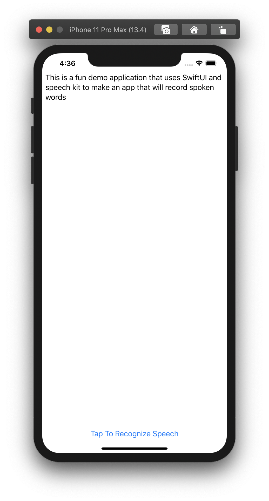

# Speech Recognition Demo App

This was a fun little app I made to experiment with Apple's Speech framework. 



The goal of this app was to help learn the speech recognition APIs, not necessarily to design a gorgeous user interface.

## Getting Started

```
git clone ...
cd ...
open SpeechRecognitionDemoApp.xcodeproj
```
## Built With

* [Speech](https://developer.apple.com/documentation/speech)
* [SwiftUI](https://developer.apple.com/documentation/swiftui)

## License

This project is licensed under the MIT License - see the [LICENSE.md](LICENSE.md) file for details
